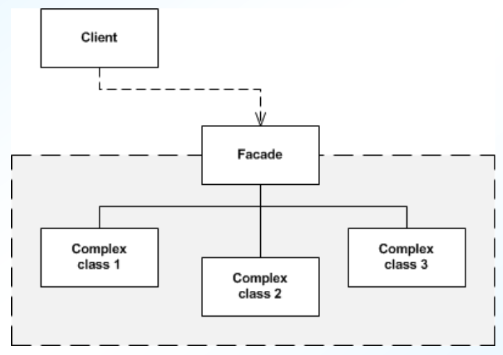

# Table of Contents
* [Design Patterns](#patterns)
    - [Facade](#facade)
    - [Observer](#observer)
    - [Factory](#factory)
- [Anti-Patterns](#anti)

# Design Patterns 
* established way to organize classes for a specific purpose
* each pattern dictates use exact use of inheritance and delegation through composition
* types
    - creational: how objects created (which objects create other objects)
        - eg) **Factory, Abstract Factory, Singleton, etc.**
    - structural: how objects associated with each other
        - eg) **Facade, Bridge, Decorator, Proxy, etc.**
    - behavioural: how objects communicate with each other
        - eg) **Observer, Strategy, Visitor, etc.**
    - architectural (**not a true design pattern!**): how objects grouped together
        - eg) **client-server, peer-to-peer, MVC, etc.**

### Facade 
* structural design pattern
* provides simplified interface to complex classes
    - user class calls simple operation on Facade class
    - Facade class calls operation on actual class(es) (delegation)

 

### Observer 
* behavioural design pattern
* allows observer classes to track subject state changes
    - subject maintains collection of observers, notifies observers when subject changes state
    - observer subscribes to notification from subject and updates itself when subject state changes

 

### Factory 
* creational design pattern
* encapsulates creation of derived objects
    - factory creates concrete objects and returns it to client class
    - client class treats concrete object as bass class object
    - client class does not need to know the type of concrete object

 

# Anti-Patterns 
* an established bad prgramming habit
* very common: the Blob
    - one class that contains most of the programs functionality
        - can be a danger of using Facade
    - also known as God object
