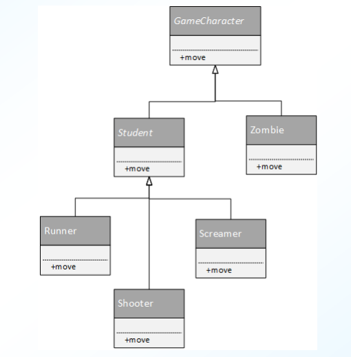
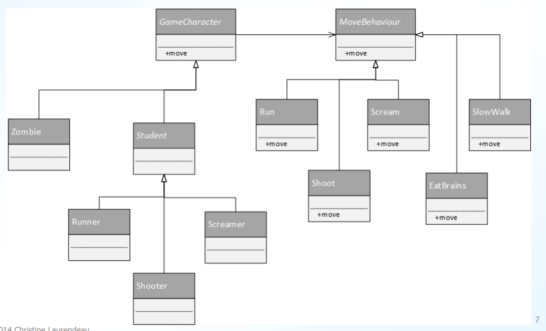
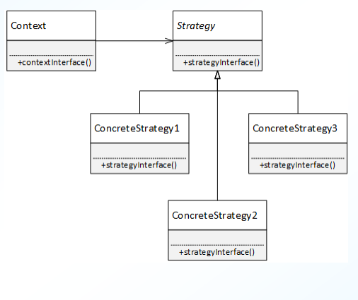
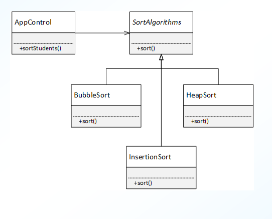

# Table of Contents
* [Interface Classes](#interclass)
    - [Using Entity Classes](#entityclass)
    - [Using an Interface Class](#usinginterclass)
- [Strategy Design Pattern](#strategy)

# Interface Classes 
* class that encapsulates set of behaviours or algorithms
* allows client class to dynamically change which code executes
* treats behaviours as an object to be swiched at runtime

#### Using Entity Classes 
* encapsulating behaviour in entity class

* traditional solution; promotes data abstraction, encapsulation; uses polymorphism
* problem: changing behaviour at runtime

#### Using an Interface Class 
* new solution:
    - encapsulate behaviour inside behaviour class
    - entity object delegates responsibility to behaviour object
    - entity object can point to different behaviour objects as needed
- encapsulating behaviour in a behaviour class

* advantages:
    - adding new behaviour
        - add new behaviour class, no need to change entity objects
    - reusing behaviours
        - zombies with guns? they can use existing shooting behaviour
        
    - behaviour can change at runtime
        - term over? zombies can become students again
        
    - still promotes data abstraction, ecapsulation, uses polymorphism

# Strategy Design Pattern 
* behavioural design pattern
* provides family of algorithms
    - defines abstract interface for family of algorithms
    - encapsulates each type of behaviour(algorithm)
    - concrete implementations are interchangeable at runtime
 
