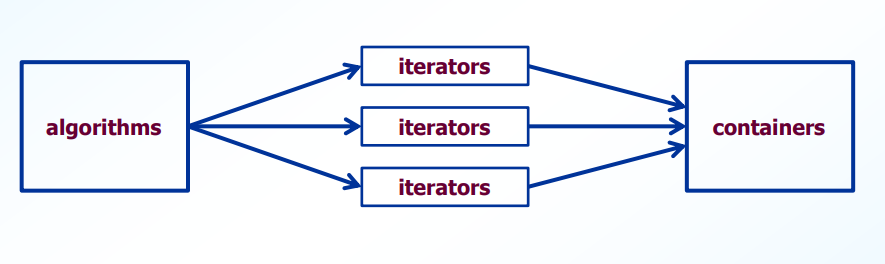

# Table on Contents
* [STL](#STL)
* [Iterators](#iterators)
    - [Purpose](#purpose)
    - [Types](#types)
    - [Categories](#categories)
- [Operations on Iterators](#operations)
- [Containers](#containers)
    - [Basics](#basics)
    - [Streams as Containers](#streams)
- [Sequence Containers](#sequence)
    - [Vectors](#vectors)
    - [Lists](#lists)
    - [Deques](#deques)
    - [Summary](#seqsum)
- [Associative Containers](#associative)
- [Container Adapters](#adapters)
- [Algorithms](#algorithms)

# STL 
* library of classes and algorithms that operate on these classes
* Good -- provide useful container classes and member functions
* Bad -- can be non-intuitive to use
* Ugly -- can severely degrade program performance
* Three key components:
    - containers
        - sequence/associative containers
        - container adapters
    - iterators
        - allow access to elements
        - used for looping
    - algorithms
        - global functions that perform operations on containers
        - typically use iterators

- algorithms do not access containers directly
    - independent from underlying container

# Iterators 
#### Purpose 
* conceptually similar to pointer
* allow access to elements of STL container
* uses:
    - traverse containers (sequence/associative containers only)
    - parameters to many STL algorithms

#### Types 
Forward iterators
* traverse container from first to last
* types: **iterator** and **const_iterator**

Reverse iterators
* traverse container from last to first
* types: **reverse_iterator** and **const_reverse_iterator**

#### Categories 
* input/output
* forward
* bidirectional
* random access
* \*\* each category includes all operations in categories above \*\*
- characteristics of Categories
    - determined by type of container
    - determines what algorithms can be used
- eg)
    - I/O stream support only input/output
    - **lists** support bidirectional
    - **vectors** support random access

# Operations on Iterators 
* **All iterators** support increment(++) and assignment(=)
* **Input iterators** support dereferencing as rvalue(\*) and comparison(==, !=)
* **Output iterators** support dereferencing as lvalue(\*)
* **Forward iterators** support functionality of input & output
* **Bidirectional iterators** support functionality of forward iteration and decrement(--)
* **Random-access iterators** support functionality of bidirectional as well as:
    - increment/decrement by *i* positions (+=i, -=i)
    - subscript( [] )
    - compare positions(<, <=, >, >=)
- Forward, bidirectional, random access iterators support:
    - container member function: **begin**
    - container member function: **end**
        - points to just **past** last element
- Bidirectional, random-access iterators support:
    - container member function: **rbegin**
        - points to last element
    - container member function: **rend**
        - point to just **past** first element
    - decrementing: **--**
- Optimal performance using iterators
    - use prefix increment/decrement (++i/--i)
        - avoid creating temp object
    - store loop ending val in variable
        - avoid calling end member function

# Containers 
#### Basics 
* data structures that contain collection of elements
* all elements of **one** type
* many member functions provided
* all STL containers provide:
    - default/copy constructor, destructor, assignment operator
    - insertion/deletion functions
        - **insert, erase, clear**
    - size-related functions
        - **size, empty, max_size**
    - relational operators
- sequence and associative provide member functions for iteration
    - **begin, end, rbegin, rend**
- to use STL containers with your classes, must provide:
    - operators for copying
        - copy constructor
        - assignment operator
    - comparison operators
        - equality/less-than operators

#### Streams as Containers 
* stream: sequence of bytes
    - files, console I/O, devices
- input/output iterators can be used on streams
- some STL algorithms can be used on streams

# Sequence Containers 
* container data structure that retain order of elements (linear)
* types: vector, list, deque
* useful member functions:
    - **front, back, push_back, pop_back**

#### Vectors 
* elements stored contiguously in memory
* **vector** grows as needed
* allows direct access to any element
    - subscript operator or **at** function
- insertion/deletion
    - very efficient at back
    - anywhere else: causes **vector** to be copied
- supports random-access iterators

#### Lists 
* implemented as doubly linked list
* elements not stored contiguously
* **list** grows as needed
* does not allow direct access to elements
* insertion/deletion efficient anywhere in **list**
* supports bidirectional iterators
* does not support random access iterators

#### Deques 
* **d**ouble-**e**nded **que**ue
* elements not stored contiguously
* **deque** grows as needed
* allows direct access to any element
* insertion/deletion
    - very efficient at front/back
    - anywhere else: more efficient than **vector** but less than **list**
- supports random access iterators

#### Sequence Containers Summary 
* **Array**
    - fixed size, direct access to elements
    - supports random access iterators
- **Deque**
    - rapid insertion at front/back
    - random access iterators
- **List**
    - doubly linked list, rapid insertion/deletion anywhere
    - support bidirectional iterators
- **Vector**
    - rapid insertion/deletion at back
    - random access iterators

# Associative Containers 
* store elements using keys (non-linear)
* keys stored in user-specified order
    - ascending is default
    - predicate can be used to specify order
- types:
    - **set**
    - **multiset**
    - **map**
    - **multimap**
- **sets** and **multisets** store keys only
- **maps** and **multimaps** store key-value pairs
- **sets** and **maps** *don't* allow duplicates
- **multisets** and **multimaps** *do* allow duplicates
- useful member functions:
    - **insert, find, lower_bound, upper_bound**
- support bidirectional iterators

# Container Adapters 
* higher level containers providing restricted access to elements
* types:
    - **stack**
    - **queue**
    - **priority_queue**
- use underlying containers to store elements
    - **stack** implemented with any sequence container
    - **queue** implemented with **deque** or **list**
    - **priority_queue** implemented with **vector** or **deque**
- user can specify underlying container
- do no support iterators

#Algorithms 
* global function templates that operate on containers using iterators
    - may work on non-STL containers (er. C-style arrays) as well
- indirect access to containers allows for more generic algorithms
    - work w/ multiple containers
- can operator on container sequences using pairs of iterators
- often return iterator
- require specific category of iterators
    - specific containers
    - also work on higher categories
- useful algorithms
    - **sort, copy, remove, fill, generate**
