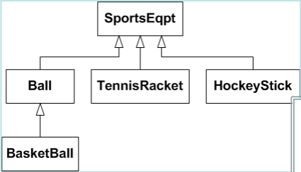

# Mechanisms
* try/thow/catch

```c++
void func(){
    float x, num, den
    //initialize num and den
    try{
        if (den==0){ //error checking
            throw "Divide by zero";  //error reporting
        }
        x = num/den;
    }catch (char * error){
        cout << error;  //error handling
    }
    //do more stuff
}
```
# Try/Throw/Catch
* throw
    * statement that generates exception
    * may be located:
        - within **try** block
        - within nested function of **try** block
* eg) throw in called function
    ```c++
        float divide(float a, float b){
            if (b == 0){ //error checking
                throw "divided by zero";  //error reporting
            }
            return a/b;
        }
        float middle(float a, float b){return divide(a,b);}
        void func(){
            float x, num, den;
            try{
                x = middle(num, den);
            }catch(char * error){
                cout << error;  //error handling
            }
        }
    ```
## Multiple **catch** blocks
* throw statement has one parameter
    - eg) **throw "divided by zero";**
* catch block with matching parameter gets to execute
    - eg) **catch(char * error)**
- catch all feature: **catch(...)**
    - **throw** parameter cannot be used
- order matters:
    - derived class
    - base class
    - catch all
- example

    

    ```c++
    void func(){
        try{
            if(/*condition*/){throw Ball();}
            // ...
        }catch(TennisRacket& t){
            // ...
        }catch(HocketStick& h){
            // ...
        }catch(BasketBall& bb){
            // ...
        }catch(Ball& b){
            // ...
        }catch(SportsEqpt& s){
            // ...
        }catch(...){
            // ...
        }
    }
    ```

# Re-throw
* exception may be caught and thrown again for:
    - nested error handling
    - cleanup
- catch block may re-throw same or new exception
```c++
    float divide(int a, int b){
        if (b == 0){ //error checking
            throw "divided by zero";
        }
        return float(a)/float(b);
    }
    float middle(float a, float b){
        try{ return divide(a,b);}
        catch(char*){
            cout << "Caught in middle";
            throw; // <-----
        }
    }
    void func(){
        float x
        int num, den;
        try{
            x = middle(num, den);
        }catch(char * error){
            cout << error;
        }
    }
```

# Throwing New Exception
* one exception may be caught and new one thrown
```c++
    float divide(int a, int b){
        if (b == 0){ //error checking
            throw "divided by zero";
        }
        return float(a)/float(b);
    }
    float middle(float a, float b){
        try{ return divide(a,b);}
        catch(char* error){
            cout << error << endl;
            throw "middle error"; // <-----
        }
    }
    void func(){
        float x
        int num, den;
        try{
            x = middle(num, den);
        }catch(char * error){
            cout << error;
        }
    }
```

# Stack Unwinding
* process of transferring control flow due to exception
* initiated at **throw** statement
* control handed over to matching **catch** block
* cleanup of nested functions bypassed
* when thrown exception not caught in particular scope:
    - function terminates
    - local variables destroyed
    - control returns to statement that invoked function
- attempts made to **catch** the exception in outer **catch** blocks
- if exception never caught, function **terminate** called
* **throw** and **catch** bypass normal return structure
*  problems:
    - local variables lost
    - memory not deallocated
    - inconsistent state

### Graceful Stack Unwinding
1. put all pointers in **catch** parameter
    * cleanup occurs in **catch** block
    * **UGLY** violates every rule of OO design
2. **Better:** put **catch** block in every nested function
    * each function cleans up after itself
    * good encapsulation
3. **Best:** make everything an object
    * destructors invoked on scope ecit
        - **return** or **exit**
        - **throw**
    - **_cleanup is automatic_**
    ```c++
    class MyArray{
        public:
            MyArray(int size){arr = new int[size];}
            ~MyArray(){delete [] arr;} // <----
        private:
            int* arr;
    }

    void d(){
        /* ... */
        if (/*condition*/){throw "error";}
        /* ... */
    }

    void f(){
        MyArray a(10);
        /* ... */
        d();
        /* ... */
    }

    void g(){
        /* ... */
        try{ f(); }
        catch(char* error){
            cout << error;
        }
    }
    ```

# Customized Termination
* custom functions can be written to handle failures
    - terminate
        - custom function executes, then normal **terminate** function
            - calls **abort**
    - abort
        - **_no destructors execute!_**

### Uncaught Exceptions
* no matching **catch** block --> call **terminate()** --> call **abort()**
* use **set_terminate()** to introduce custom processing
```c++
    void my_terminate(){
        cout << "Uncaught exception\n";
    }

    float divide(int x, int y){
        if (y == 0){
            throw "divide by zero";
        }
        return float(x)/float(y);
    }

    int main(){
        set_terminate(my_terminate);
        try{
            cout << divide(1,0);
        }
        return(0);
    }
```

# Exception Specifications
* function declaration may specify types of exceptions
```c++
    int func(int x) throw(int, Error_message){ /* ... */}
```
    - may throw **int** or **Error_message**
```c++
    int func(int x){ /* ... */}
```
    - default: may throw any exception
```c++
    int func(int x) throw() { /* ... */}
```
    - may not throw any exception

* unexpected **throw** --> call **unexpected()** --> **terminate()**
* use **set_unexpected()** to introduce custom processing
